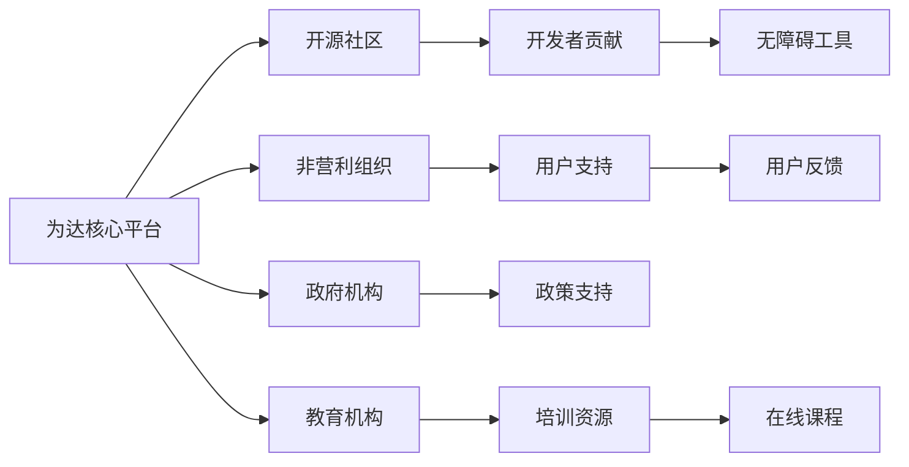

### **为达（Vidorra-Care）开源公益项目远景蓝图**

---

#### **🌍 愿景（Vision）**
**让每个人都能无障碍地拥抱数字世界**
通过开源技术和AI的力量，消除互联网使用中的障碍，让老年人、听障人士、视障人士和行动不便者等群体能够平等地获取信息、参与社交和享受数字生活。

---

#### **🎯 使命（Mission）**
**构建一个包容的数字生态系统**
1. **开放协作**：通过开源社区的力量，持续改进和扩展无障碍技术解决方案。
2. **智能辅助**：利用AI技术提供个性化的辅助功能，满足不同用户的特定需求。
3. **教育赋能**：提供易于理解的学习资源，帮助用户掌握互联网使用技能。

---

#### **🌟 核心价值（Core Values）**
| 维度         | 内涵诠释                                                                 |
|--------------|--------------------------------------------------------------------------|
| **开放共享** | 通过开源平台，汇聚全球开发者的智慧，推动无障碍技术的普及与创新。         |
| **用户中心** | 以用户需求为导向，设计直观、易用的界面和功能，提升用户体验。             |
| **社会责任** | 致力于缩小数字鸿沟，促进社会公平与包容。                               |

---

#### **🚀 项目规划（Roadmap）**
**▎第一阶段：基础构建（2025年中旬-2026年）**
- **技术开发**：
  - 创建开源无障碍组件库，支持网页和应用的无障碍设计。
  - 开发AI驱动的语音识别和文本转语音工具，帮助聋人和盲人用户。
- **社区建设**：
  - 吸引开发者和设计师加入开源社区，贡献代码和设计方案。

**▎第二阶段：功能扩展（2027-2028）**
- **生态系统扩展**：
  - 推出多语言支持，扩大国际用户群体。
  - 开发适用于不同设备（如手机、平板、电脑）的无障碍解决方案。
- **用户参与**：
  - 开展用户测试和反馈收集，持续优化产品功能和用户体验。

**▎第三阶段：全球推广（2029-2030）**
- **国际合作**：
  - 与全球非营利组织和政府机构合作，推动无障碍技术的全球应用。
- **教育推广**：
  - 开发在线课程和培训资源，帮助用户和开发者掌握无障碍技术。

---

#### **🔑 关键里程碑（Milestones）**
| 时间节点   | 突破目标                                                                 |
|------------|--------------------------------------------------------------------------|
| 2025 Q4    | 发布首个开源无障碍组件库，支持基本网页无障碍功能。                       |
| 2027年中   | 实现AI驱动的语音识别和文本转语音工具的多语言支持。                       |
| 2029       | 与至少10个国家的政府和非营利组织建立合作关系，推广无障碍技术。           |

---

#### **🌱 生态合作网络**

---

#### **💡 创新点亮未来**
- **个性化助手**：
  利用AI技术，根据用户的使用习惯和需求，提供个性化的无障碍辅助功能。
- **社区驱动创新**：
  通过开源社区的力量，持续推动无障碍技术的创新和应用，形成良性循环。

---

**为达（Vidorra-Care）不仅是一个技术项目，更是一项社会使命。** 我们致力于通过开源和AI技术，消除数字世界的障碍，让每个人都能平等地享受互联网带来的便利和乐趣。通过全球合作和社区参与，我们将共同创造一个更加包容和公平的数字未来。
